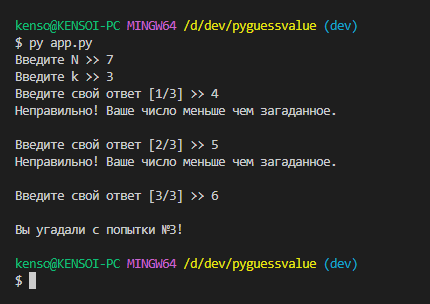
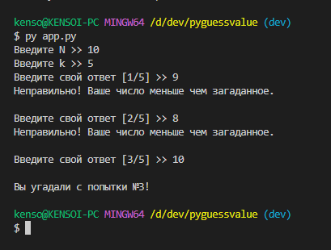

# Угадайка

## Автор программы
Прокофьев Андрей Алексеевич, группа Фт210008  

## Краткое описание программы
Игра "угадай число", написанное при помощи Python  
ТЗ: Компьютер загадывает число от 1 до N. У пользователя k попыток отгадать. После каждой неудачной попытки компьютер сообщает меньше или больше загаданное число. В конце игры текст с результатом (или «Вы угадали», или «Попытки закончились»). 

## Системные требования
Для запуска требуется Python версии 3.10 (можно скачать с официального сайта Python) и умение пользоваться командной строкой.

## Установка и запуск программы (Bash)
```bash
git clone https://github.com/kensoidev/pyguessvalue.git
cd pyguessvalue
python3 app.py
```

## Как пользоваться?
Вводить числа с клавиатуры в командную строку

## Скриншоты


